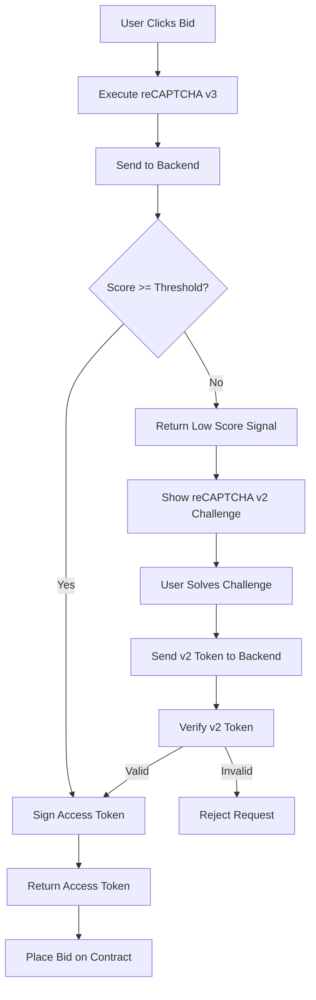

# reCAPTCHA v3 with v2 Fallback Implementation Plan

## Overview

Implement a fallback mechanism from reCAPTCHA v3 to v2 to enhance security while maintaining user experience. When v3 scores a user interaction below the threshold, v2 will present an interactive challenge.

Reference: [Securing Web Forms: Implementing Google reCAPTCHA V3 with V2 Fallback](https://medium.com/epsilon-engineering-blog/securing-web-forms-implementing-google-recaptcha-v3-with-v2-fallback-96dd93474482)

## Current Implementation

✅ **Already Implemented:**
- reCAPTCHA v3 loaded in layout.tsx
- Backend verification API at `/api/verify-and-sign`
- Score threshold check (currently 0.2)
- Smart contract signature verification
- Access token system with time limits

## Architecture Changes



## Implementation Plan

### Phase 1: Backend Changes (Priority: High)

#### 1.1 Update Environment Variables
Add new environment variables for reCAPTCHA v2:
```bash
# .env.local (add these)
NEXT_PUBLIC_RECAPTCHA_V2_SITE_KEY=your_v2_site_key_here
RECAPTCHA_V2_SECRET_KEY=your_v2_secret_key_here
```

#### 1.2 Modify `/api/verify-and-sign/route.ts`

**Changes needed:**

1. Add v2 verification function:
```typescript
async function verifyRecaptchaV2(token: string): Promise<boolean> {
  const secretKey = process.env.RECAPTCHA_V2_SECRET_KEY;
  
  if (!secretKey) {
    console.error("RECAPTCHA_V2_SECRET_KEY not found");
    return false;
  }

  try {
    const response = await fetch("https://www.google.com/recaptcha/api/siteverify", {
      method: "POST",
      headers: { "Content-Type": "application/x-www-form-urlencoded" },
      body: `secret=${secretKey}&response=${token}`,
    });

    const data = await response.json();
    return data.success === true;
  } catch (error) {
    console.error("reCAPTCHA v2 verification failed:", error);
    return false;
  }
}
```

2. Modify the main POST handler to return score info:
```typescript
// When v3 score is low, return special response
if (score < scoreThreshold) {
  console.log(`reCAPTCHA v3 score too low: ${score} < ${scoreThreshold}`);
  return NextResponse.json(
    { 
      error: "Low score", 
      requiresV2: true,
      score: score 
    },
    { status: 403 }
  );
}
```

3. Accept both v3 and v2 tokens:
```typescript
interface VerifyAndSignRequest {
  address: string;
  humanProof: string;
  auctionId: string;
  recaptchaVersion?: "v3" | "v2"; // Add this field
}

// In POST handler:
const isV2 = body.recaptchaVersion === "v2";
const isHuman = isV2 
  ? await verifyRecaptchaV2(humanProof)
  : await verifyRecaptcha(humanProof);
```

### Phase 2: Frontend Changes (Priority: High)

#### 2.1 Update `layout.tsx`

Load both v3 and v2 scripts:
```tsx
<head>
  {/* reCAPTCHA v3 - invisible */}
  <script 
    src={`https://www.google.com/recaptcha/api.js?render=${process.env.NEXT_PUBLIC_RECAPTCHA_SITE_KEY}`}
    async 
    defer
  ></script>
  
  {/* reCAPTCHA v2 - will be rendered on demand */}
  <script 
    src="https://www.google.com/recaptcha/api.js"
    async 
    defer
  ></script>
</head>
```

#### 2.2 Update `HomeClient.tsx`

**Add state for v2 challenge:**
```typescript
const [showV2Challenge, setShowV2Challenge] = useState(false);
const [v2Token, setV2Token] = useState<string | null>(null);
const v2WidgetRef = useRef<number | null>(null);
```

**Create v2 challenge component:**
```typescript
const renderV2Challenge = () => {
  if (typeof window !== "undefined" && (window as any).grecaptcha) {
    const siteKey = process.env.NEXT_PUBLIC_RECAPTCHA_V2_SITE_KEY;
    if (!siteKey) return;

    // Clear previous widget if exists
    if (v2WidgetRef.current !== null) {
      try {
        (window as any).grecaptcha.reset(v2WidgetRef.current);
      } catch (e) {
        console.log("Could not reset v2 widget", e);
      }
    }

    // Render new widget
    setTimeout(() => {
      const container = document.getElementById("recaptcha-v2-container");
      if (container) {
        v2WidgetRef.current = (window as any).grecaptcha.render(container, {
          sitekey: siteKey,
          callback: (token: string) => {
            setV2Token(token);
            setShowV2Challenge(false);
          },
          "expired-callback": () => {
            setV2Token(null);
          },
        });
      }
    }, 100);
  }
};
```

**Modify `getAccessToken` function:**
```typescript
const getAccessToken = async (params: { 
  address: string; 
  humanProof: string; 
  auctionId: bigint;
  recaptchaVersion?: "v3" | "v2";
}) => {
  const response = await fetch("/api/verify-and-sign", {
    method: "POST",
    headers: { "Content-Type": "application/json" },
    body: JSON.stringify({
      ...params,
      auctionId: params.auctionId.toString(),
      recaptchaVersion: params.recaptchaVersion || "v3",
    }),
  });

  if (!response.ok) {
    const errorData = await response.json();
    
    // Check if v2 challenge is required
    if (response.status === 403 && errorData.requiresV2) {
      return { requiresV2: true, score: errorData.score };
    }
    
    toast.error("Are you human? Please reload and try again!");
    throw new Error(errorData.error || "Failed to get access token");
  }

  return response.json();
};
```

**Update bid flow to handle v2 fallback:**
```typescript
const handleBid = async (referral: string) => {
  if (!connectedAddress) return;

  try {
    setIsBidding(true);
    setBidStatus("Verifying you're human...");

    // Step 1: Try v3 first
    let humanProof = await verifyHuman(); // v3 token
    let result = await getAccessToken({
      address: connectedAddress,
      humanProof,
      auctionId: BigInt(auctionId),
    });

    // Step 2: If v2 is required, show challenge
    if (result.requiresV2) {
      setBidStatus("Additional verification required...");
      setShowV2Challenge(true);
      renderV2Challenge();

      // Wait for v2 token
      await new Promise<void>((resolve, reject) => {
        const checkToken = setInterval(() => {
          if (v2Token) {
            clearInterval(checkToken);
            resolve();
          }
        }, 500);

        // Timeout after 2 minutes
        setTimeout(() => {
          clearInterval(checkToken);
          reject(new Error("V2 challenge timeout"));
        }, 120000);
      });

      // Get access token with v2
      result = await getAccessToken({
        address: connectedAddress,
        humanProof: v2Token!,
        auctionId: BigInt(auctionId),
        recaptchaVersion: "v2",
      });
      
      setV2Token(null); // Clear for next use
    }

    // Step 3: Place bid with access token
    setBidStatus("Placing bid...");
    const { accessToken } = result;
    await writeContractAsync({
      functionName: "placeBid",
      args: [
        {
          wallet: accessToken.message.wallet,
          timestamp: BigInt(accessToken.message.timestamp),
          auctionId: BigInt(accessToken.message.auctionId),
          signature: accessToken.signature,
        },
        referral as `0x${string}`,
      ],
    });

    toast.success("Bid placed successfully!");
  } catch (error) {
    console.error("Bid error:", error);
    toast.error("Failed to place bid");
  } finally {
    setIsBidding(false);
    setBidStatus("");
    setShowV2Challenge(false);
  }
};
```

**Add v2 challenge UI:**
```tsx
{/* reCAPTCHA v2 Challenge Modal */}
{showV2Challenge && (
  <div className="fixed inset-0 bg-black bg-opacity-50 flex items-center justify-center z-50">
    <div className="bg-base-100 p-6 rounded-xl shadow-xl">
      <h3 className="text-xl font-bold mb-4">Additional Verification Required</h3>
      <p className="mb-4">Please complete this challenge to continue</p>
      <div id="recaptcha-v2-container"></div>
      <button
        className="btn btn-sm btn-ghost mt-4"
        onClick={() => {
          setShowV2Challenge(false);
          setIsBidding(false);
        }}
      >
        Cancel
      </button>
    </div>
  </div>
)}
```

### Phase 3: Configuration & Testing

#### 3.1 Get reCAPTCHA v2 Keys
1. Go to [Google reCAPTCHA Admin](https://www.google.com/recaptcha/admin)
2. Register a new site or edit existing
3. Select "reCAPTCHA v2" → "I'm not a robot" Checkbox
4. Add domains
5. Copy Site Key and Secret Key

#### 3.2 Update Environment Variables
```bash
# Add to .env.local
NEXT_PUBLIC_RECAPTCHA_V2_SITE_KEY=your_v2_site_key
RECAPTCHA_V2_SECRET_KEY=your_v2_secret_key
```

#### 3.3 Testing Strategy

**Test Cases:**
1. ✅ Normal flow (high v3 score) - should not show v2
2. ✅ Low v3 score - should show v2 challenge
3. ✅ V2 challenge completion - should allow bid
4. ✅ V2 challenge cancellation - should cancel bid
5. ✅ V2 token expiration - should handle gracefully
6. ✅ Backend v2 verification - should validate correctly

**Test with low score:**
- Temporarily lower threshold to 0.9 in backend
- Test that v2 challenge appears
- Complete challenge and verify bid goes through

### Phase 4: Production Considerations

#### 4.1 Score Threshold Tuning
- Start with 0.3 threshold
- Monitor false positives/negatives
- Adjust based on bot activity

#### 4.2 Monitoring
Add logging for:
- V3 score distribution
- V2 challenge trigger rate
- V2 challenge completion rate
- Failed verification attempts

#### 4.3 User Experience
- Clear messaging when v2 is required
- Smooth transition from v3 to v2
- Timeout handling for v2 challenge
- Option to retry if v2 fails

#### 4.4 Security
- Rate limiting on verify-and-sign endpoint
- Log suspicious patterns (multiple v2 triggers)
- Monitor for automated v2 solving attempts
- Consider IP-based rate limiting

## Implementation Checklist

### Backend (route.ts)
- [ ] Add RECAPTCHA_V2_SECRET_KEY env variable
- [ ] Create verifyRecaptchaV2 function
- [ ] Modify verifyRecaptcha to return score on low threshold
- [ ] Update POST handler to accept recaptchaVersion parameter
- [ ] Return requiresV2: true when score is low
- [ ] Add logging for v2 challenge triggers

### Frontend (layout.tsx)
- [ ] Add NEXT_PUBLIC_RECAPTCHA_V2_SITE_KEY env variable
- [ ] Load reCAPTCHA v2 script alongside v3

### Frontend (HomeClient.tsx)
- [ ] Add state for showV2Challenge, v2Token, v2WidgetRef
- [ ] Create renderV2Challenge function
- [ ] Update getAccessToken to handle v2 fallback
- [ ] Modify bid flow to trigger v2 when needed
- [ ] Add v2 challenge modal UI
- [ ] Add cleanup for v2 widget on unmount
- [ ] Add timeout handling for v2 challenge

### Configuration
- [ ] Get reCAPTCHA v2 keys from Google
- [ ] Update .env.local with v2 keys
- [ ] Test in development environment
- [ ] Deploy and test in production

### Documentation
- [ ] Update BOT_PREVENTION_SETUP.md with v2 instructions
- [ ] Document v2 fallback behavior
- [ ] Add troubleshooting section for v2 issues

## Expected Outcomes

### User Experience
- **High score users (most users)**: No change, seamless v3 experience
- **Low score users**: Brief additional step with v2 challenge
- **Overall**: Better security without annoying legitimate users

### Security Improvements
- **Reduced false negatives**: V2 catches bots that pass v3 with low scores
- **Flexible defense**: Can adjust threshold without blocking all users
- **Bot deterrence**: Multi-layered verification makes automation harder

### Metrics to Track
- V3 score distribution
- V2 trigger rate (target: < 5% of users)
- V2 completion rate (target: > 90%)
- Failed bid attempts
- Time to complete bid (with/without v2)

## Rollout Strategy

1. **Week 1**: Implement backend changes, deploy to dev
2. **Week 2**: Implement frontend changes, test thoroughly
3. **Week 3**: Deploy to staging, gather metrics
4. **Week 4**: Deploy to production with monitoring
5. **Week 5+**: Tune threshold based on data

## Rollback Plan

If issues arise:
1. Set threshold to 0.1 (almost never trigger v2)
2. Or: Skip v2 verification temporarily (accept low scores)
3. Or: Revert to previous version

Backend flag to disable v2:
```typescript
const ENABLE_V2_FALLBACK = process.env.ENABLE_V2_FALLBACK === "true";
```
